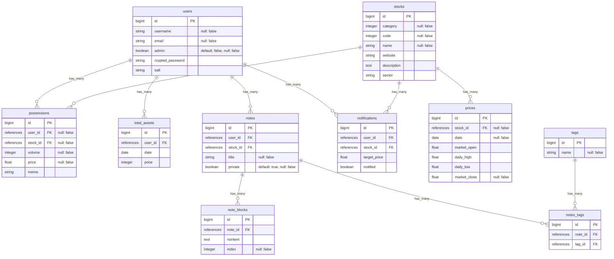

# 投資NOTE
## アプリのURL
[https://invest-app.onrender.com/](https://invest-app.onrender.com/)

### テスト用ユーザー
メールアドレス： test@example.com  
パスワード：password

## サービス概要
自身の投資に関する情報をまとめておき、管理しやすくするためのツールです。  

## ターゲットユーザー
個人で趣味で投資を行っている人（自分）

## 開発の背景
投資を行うにあたっては、投資先の企業やファンドについての情報を収集することで、適切な投資先を選ぶということが必要になります。  
自身の経験ですが、収集した情報をエクセルで管理していましたが、検索→入力の手間がそこそこかかります。  
情報も数値的なものだったり、Webページの記事、Twitter上の発言など種類もさまざまあります。  
それらをまとめるだけならばノートアプリでも事足りますが、銘柄の値動きの管理や、まとめる際に簡単に企業の情報が参照できる仕組みを用意できれば、差別化ができるのではないかと考え開発に至りました。  
（現場その差別化部分が弱いですが・・・。）

## 使用技術
### バックエンド
- Ruby (3.1.3)
- Ruby on Rails (7.0.4.2)

### フロントエンド
- Bootstrap5

### 主なライブラリ(Gem)
- Sorery (ログイン機能)
- Chartkick (グラフの表示)
- Redcarpet（ノート入力にMarkdownを使用可能に）

## 機能紹介
()は現在未実装の機能
### 主な機能
- 保有銘柄の管理
- 保有資産額の確認
- 投資ノートの作成
- (株価のアラート機能)
### その他の機能
- マイページ

## 画面遷移図
初期の作成版のため現在のアプリの構成と異なる部分も多々あります・・・。

[Figma](https://www.figma.com/file/nAPlbjiC8h5Lw0zD5VDuah/portfolio?node-id=0%3A1&t=aBVFnTIgUIWNZDpE-1)
## ER図

## 実装時のメモ
Notionにて実装時のメモを書いていますのでリンクを記載します。  
個人用メモなので雑＆ざっくりな部分も多いですがご容赦ください。

https://sneaky-drug-f5e.notion.site/2-b04c7e02465844ce84dcbe02b65f0fc7?pvs=4
