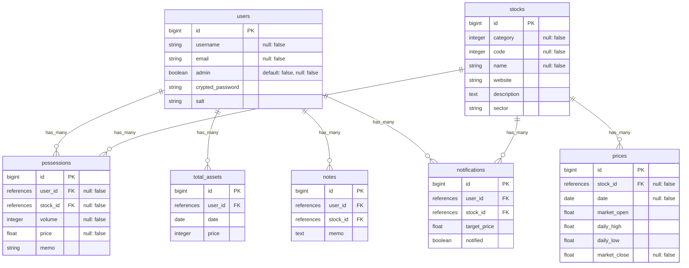

# サービス名
Invest APP(仮称)

# サービス概要
自身の投資に関する情報をまとめておき、管理しやすくするためのツールです。  

# ターゲットユーザー
投資を行っている個人の方

# 開発の背景
投資を行うにあたっては、投資先の企業やファンドについての情報を収集することが欠かせません。  
自身の経験ですが、収集した情報をエクセルで管理していましたが、検索→入力の手間がそこそこかかります。  
情報も数値的なものだったり、Webページの記事、Twitter上の発言など種類もさまざまで、  
エクセルでは管理が難しいと感じ、投資情報をある程度自動的に取得でき、さまざまな情報を綺麗にまとめられるサービスが欲しいと思い、開発を始めました。

# 使用技術
## バックエンド
- Ruby (3.1.0)
- Ruby on Rails (7.0.4.2)

## フロントエンド
- Bootstrap

## 主なライブラリ(Gem)
- Sorery (ログイン機能)
- Chartkick (グラフの表示)

# 機能紹介
()は作成中の機能
## 主な機能
- 保有銘柄の管理
- 保有資産額の確認
- (投資ノートの作成)
- (株価のアラート機能)
## その他の機能
- (マイページ)

# 画面遷移図
[Figma](https://www.figma.com/file/nAPlbjiC8h5Lw0zD5VDuah/portfolio?node-id=0%3A1&t=aBVFnTIgUIWNZDpE-1)
# ER図

